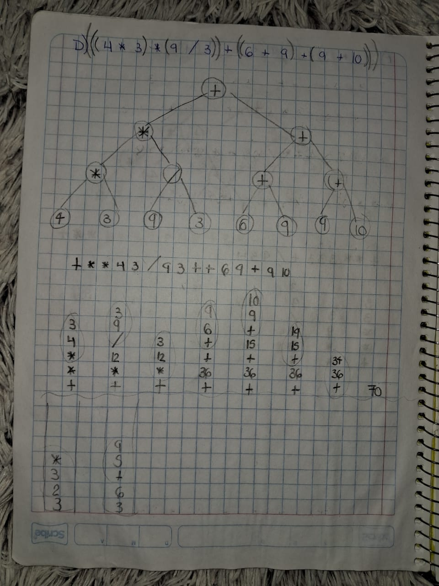

# Tareas - Common Lisp

## Transformar una expresión de Inorden a Preorden
Se resolvieron unos ejercicios para entender como los compiladores evaluan expresiones matemáticas y para familiarizarnos con la forma en que Common Lisp las implementa


## Recorrido de árboles binarios en Preorden
Se implementó otra forma de escribir las expresiones utilizando paréntesis para dividirlas por operación y después construir un árbol de expresión con el resultado final 




## Recorrido de árboles binarios en Preorden y Postorden


## Operaciones de área y volúmen en Common Lisp
Se crearon varias funciones para familiarizarnos con Common Lisp, especialmente con `setq`, que asigna valores a variables. También nos ayudó a entender cómo se manejan las operaciones matemáticas. En Common Lisp, se usa una notación prefija, donde el operador va antes de los números, como `(* base altura)` en lugar de `base * altura`.
```lisp
; Áreas
(defun area-cuadrado(lado)
    (setq resultado (* lado lado))
    (format t "Área del cuadrado: ~A~%" resultado)
    (values)
)

(defun area-trapecio (base-menor base-mayor altura)
    ; (B + b) * h / 2
    ; / (* h (+ B b)) 2
    (setq resultado (/ (* altura (+ base-mayor base-menor)) 2))
    (format t "Área del trapecio: ~A~%" resultado)
    (values)
)

(defun area-rectangulo (altura base)
    (setq resultado (* base altura))
    (format t "Área del rectángulo: ~A~%" resultado)
    (values)
)

(defun area-triangulo (altura base)
    ; b * h / 2
    ; / (* b h) 2
    (setq resultado (/ (* base altura) 2)) 
    (format t "Área del triángulo: ~A~%" resultado)
    (values)
)

(defun area-circulo (radio)
    ; pi * radio^2
    ; * pi (* radio radio)
    (setq resultado (* pi (* radio radio)))
    (format t "Área del círculo: ~A~%" resultado)
    (values)
)

; Volúmenes
(defun volumen-cubo (lado)
    ; l * l * l
    ; * l (* l l)
    (setq resultado (* (* lado lado) lado))
    (format t "Volumen del cubo: ~A~%" resultado)
    (values)
)

(defun volumen-cilindro (radio altura)
    ; pi * r^2 * h
    ; * (* pi (* radio radio)) h
    (setq resultado (* (* pi (* radio radio)) altura))
    (format t "Volumen del cilindro: ~A~%" resultado)
    (values)
)

(defun volumen-esfera (radio)
    ; 4/3 * pi * r^3
    ; * ( * (/ 4 3) pi ) (* (* radio radio) radio)))
    (setq resultado (* (*(/ 4 3) pi) (* (* radio radio) radio)))
    (format t "Volumen de la esfera: ~A~%" resultado)
    (values)
)

(defun volumen-cono (radio altura)
    ; 1/3 * pi * r^2 * h
    ; (*(*(*(/ 1 3) pi) (* r r))h)
    (setq resultado (*(*(*(/ 1 3) pi) (* radio radio))altura))
    (format t "Volumen del cono: ~A~%" resultado)
    (values)
)

(defun volumen-piramide-rectangular (area-base altura)
    ; ab * h / 3
    ; / (* ab h) 3
    (setq resultado (/ (* area-base altura) 3))
    (format t "Volumen de la pirámide rectángular: ~A~%" resultado)
    (values)
)
```

## Funciones Primitivas en CLISP
Se investigaron las operaciones primitivas en CLISP, las cuales nos permiten realizar tareas como cálculos matemáticos y lógicos, así como la manipulación de listas y el control del flujo de ejecución.
### 1. Operaciones Matemáticas Básicas
- `+` → Suma
- `-` → Resta
- `*` → Multiplicación
- `/` → División
- `mod` → Módulo
- `1+` → Incrementar en 1
- `1-` → Decrementar en 1

### 2. Operaciones Lógicas
- `and` → Conjunción lógica
- `or` → Disyunción lógica
- `not` → Negación lógica

### 3. Comparaciones
- `=` → Comparación de igualdad numérica
- `/=` → Diferencia
- `<` → Menor que
- `>` → Mayor que
- `<=` → Menor o igual
- `>=` → Mayor o igual

### 4. Manipulación de Listas
- `car` → Devuelve el primer elemento de una lista
- `cdr` → Devuelve la cola de una lista
- `cons` → Construye una nueva lista con un elemento y una lista
- `list` → Crea una lista con los elementos dados
- `append` → Concatena listas
- `length` → Longitud de una lista
- `reverse` → Invierte una lista

### 5. Control de Flujo
- `if` → Estructura condicional
- `cond` → Expresión condicional múltiple
- `case` → Selección basada en valores
- `loop` → Bucle iterativo
- `do` → Bucle generalizado

### 6. Funciones y Evaluación
- `lambda` → Crea una función anónima
- `apply` → Aplica una función a una lista de argumentos
- `funcall` → Llama a una función con argumentos explícitos
- `mapcar` → Aplica una función a cada elemento de una lista

### 7. Entrada y Salida
- `print` → Imprime un valor con salto de línea
- `format` → Imprime texto con formato
- `read` → Lee una expresión desde la entrada

### 8. Tipos y Conversión de Datos
- `type-of` → Devuelve el tipo de un objeto
- `integerp` → ¿Es un entero?
- `floatp` → ¿Es un número de punto flotante?
- `stringp` → ¿Es una cadena?
- `symbolp` → ¿Es un símbolo?

## Car y Cdr con listas
Se realizaron ejercicios para comprender cómo manipular listas en Common Lisp utilizando `car` y `cdr`. `car` devuelve el primer elemento de una lista, mientras que `cdr` devuelve el resto de la lista (todo excepto el primer elemento). Combinando estas funciones, podemos extraer elementos específicos, incluso si están anidados profundamente dentro de otras listas
```lisp
; 1 Problemas con car y cdr

;- `car` → Devuelve el primer elemento de una lista
;- `cdr` → Devuelve la cola de una lista

;  Lista: (a b c d e) → Extraer d
(cadddr '(a b c d e))

;  Lista: ((1 2) (3 4) (5 6)) → Extraer 5
(caaddr '((1 2) (3 4) (5 6)))

;  Lista: ((a b) (c d) (e f)) → Extraer e
(caaddr '((a b) (c d) (e f)))

;  Lista: ((x y) ((p q) (r s)) (z w)) → Extraer z
(caaddr '((x y) ((p q) (r s)) (z w)))

;  Lista: ((1 (2 3)) (4 (5 6))) → Extraer 6
(cadr(cadr(cadr '((1 (2 3)) (4 (5 6))))))

(cadr(cadadr '((1 (2 3)) (4 (5 6)))))

;  Lista: (((a b) c) d e) → Extraer c
(cadar '(((a b) c) d e))

;  Lista: (((1 2) 3) ((4 5) 6)) → Extraer 6
(cadadr '(((1 2) 3) ((4 5) 6)))

;  Lista: ((p (q (r s))) t u) → Extraer (r s)
(cadr(cadr(car '((p (q (r s))) t u))))
(car(cdadar '((p (q (r s))) t u)))

;  Lista: (((a) b) (c (d e)) f) → Extraer d
(caadr(cadr '(((a) b) (c (d e)) f)))

;  Lista: ((1 (2 (3 4))) (5 6)) → Extraer 3
(caadr(cadr(car '((1 (2 (3 4))) (5 6)))))
(caar(cdadar '((1 (2 (3 4))) (5 6))))

;  Lista: (((x) (y)) ((z) (w))) → Extraer (w)
(cadr(cadr '(((x) (y)) ((z) (w)))))

;  Lista: ((a (b (c d))) (e f)) → Extraer c
(caadr(cadr(car '((a (b (c d))) (e f)))))
(caar(cdadar '((a (b (c d))) (e f))))

;  Lista: ((1 (2 (3 (4 5)))) (6 7)) → Extraer 4
(caadr(cadr(cadr(car '((1 (2 (3 (4 5)))) (6 7))))))
(caadar(cdadar ' ((1 (2 (3 (4 5)))) (6 7))))

;  Lista: (((a b) c) ((d e) f) ((g h) i)) → Extraer g
(caaadr(cdr '(((a b) c) ((d e) f) ((g h) i))))

;  Lista: (((x y) (z w)) ((p q) (r s))) → Extraer r
(caadr(cadr '(((x y) (z w)) ((p q) (r s)))))

;  Lista: ((1 (2 (3 (4 (5 6))))) (7 8)) → Extraer 5
(caar(cdadar(cdadar '((1 (2 (3 (4 (5 6))))) (7 8)))))

;  Lista: ((a (b (c (d e)))) (f g)) → Extraer d
(caadar(cdadar '((a (b (c (d e)))) (f g))))

;  Lista: (((1 2) (3 4)) ((5 6) (7 8))) → Extraer 7
(car(cadadr '(((1 2) (3 4)) ((5 6) (7 8)))))

;  Lista: ((x (y (z (w v))))) → Extraer w
(caadar(cdadar '((x (y (z (w v)))))))

;  Lista: (((a b c) (d e f)) ((g h i) (j k l))) → Extraer j
(car(cadadr '(((a b c) (d e f)) ((g h i) (j k l)))))
```

## Factorial en Common Lisp
La función `fact` (factorial) calcula el producto de un número entero positivo y todos los enteros positivos menores que él. Su caso base es cuando `n` es 0, devolviendo 1. De lo contrario, multiplica `n` por el factorial de `n-1`.
```lisp
(defun fact (n)
    (if (= n 0)
        1
        (* n (fact(- n 1)))
    )
)
```

## Fibonacci en Common Lisp
La función `fib` (Fibonacci) genera una secuencia donde cada número es la suma de los dos anteriores. Tiene dos casos base: si `n` es menor que 2, devuelve 1. Si no, suma los resultados de `fib` para `n-1` y `n-2`
```lisp
(defun fib (n)
    (if (< n 2)
        1 
        (+  (fib(- n 1)) (fib(- n 2)))
    )
)
```

## Calcular el exponente de un número de manera recursiva
Para calcular el exponente de un número, desarrollé la función `power`, que hace uso de la recursividad. Esta función se basa en la idea de que x <sup>n</sup> es igual a x multiplicado por x<sup>n−1</sup>. La condición base para la recursividad es cuando el exponente (`exp`) es 0, en cuyo caso el resultado es 1. Para la operación de multiplicación recursiva, se definió una función `multiply` que suma `x` consigo mismo `y` veces; su caso base es cuando `y` es 0, devolviendo 0. Así, power llama repetidamente a multiply para obtener el resultado final.
```lisp
(defun multiply (x y)
  (if (= y 0)
      0
      (+ x (multiply x (- y 1)))))

(defun power (base exp)
  (if (= exp 0)
      1
      (multiply base (power base (- exp 1)))))
```

## Calcular una división utilizando restas de manera recursiva
Para realizar una división utilizando únicamente restas, implementé la función `divide` de forma recursiva. Esta función simula la división restando el divisor (`y`) del dividendo (`x`) repetidamente hasta que el dividendo sea menor que el divisor. Cada vez que se realiza una resta, se suma 1 al resultado. La recursión finaliza cuando el dividendo (`x`) es menor que el divisor (`y`), devolviendo 0 como caso base. De esta manera, se cuenta cuántas veces se puede restar el divisor del dividendo.
```lisp
(defun divide (x y)
  (if (< x y)
      0
      (+ 1 (divide (- x y) y))))

```

## Juego "Adivina mi número" 
Este código del libro `Land of Lisp` implementa un juego de adivinar un número entre 1 y 100 usando una búsqueda binaria. El juego utiliza dos variables globales, `*small*` y `*big*`, para definir el rango de búsqueda actual.

`start-over`: Inicia el juego, estableciendo el rango inicial de 1 a 100 y haciendo la primera suposición.
`guess-my-number`: Calcula la suposición actual tomando el punto medio del rango actual (`*small*` y `*big*`) 
`smaller`: Si el número es menor, ajusta el límite superior (`*big*`) para reducir el rango.
`bigger`: Si el número es mayor, ajusta el límite inferior (`*small*`) para reducir el rango.

Con cada indicación ("menor" o "mayor"), el juego reduce a la mitad el espacio de búsqueda, acercándose rápidamente a el número.
```lisp
(defun guess-my-number ()
    (ash (+ *small* *big*) -1)
)

(defun smaller()
    (setf *big* (1- (guess-my-number)))
    (guess-my-number)
)

(defun bigger()
    (setf *small* (1+ (guess-my-number)))
    (guess-my-number)
)

(defun start-over()
    (defparameter *small* 1)
    (defparameter *big* 100)
    (guess-my-number)
)
```

## Recorrer listas en Common Lisp
Estas dos funciones de Common Lisp, `recorre` y `recorre-par`, son ejemplos recursivos diseñados para procesar elementos en una lista. `recorre` itera sobre una lista e imprime cada uno de sus elementos. Por otro lado, `recorre-par` también recorre la lista, pero solo imprime los números pares que encuentra. Ambas funciones demuestran la recursividad llamándose a sí mismas con el "resto" de la lista `((cdr lista))` hasta que la lista está vacía, momento en el que la recursión se detiene.
```lisp
(defun recorre(lista)
    (format t "->~d" (car lista))
    (if lista
        (recorre (cdr lista)) 
    )
)

; Dada una lista solamente imprime los numeros pares de esa lista
(defun recorre-par(lista)
    (if lista
        (progn
            (if ( = (mod (car lista) 2) 0) 
                (format t "->~d" (car lista))
            )
            (recorre-par (cdr lista)) 
        )
    )
)
```

## Condicionales en Common Lisp
Este código del libro `Land of Lisp` define cómo reaccionar si alguien se come tu pudín, usando una variable global `*arch-enemy*`. Las funciones `pudding-eater` (con `cond`) y `pudding-eater-case` (con `case`) asignan un enemigo específico (`stupid-lisp-alien` o `useless-old-johnny`) y una frase según quién sea la `person`, o una genérica si es un `stranger`. Además, se muestran ejemplos de los operadores lógicos `and` (todas las condiciones deben ser verdaderas) y `or` (al menos una condición debe ser verdadera) para combinaciones de verificaciones.

Este código más que nada fue para aprender cómo se implementan las condicionales en Common Lisp, explorando `cond` y `case` para controlar el flujo del programa.
```lisp
(defvar *arch-enemy* nil)

(defun pudding-eater (person)
    (cond   ((eq person 'henry) 
                    (setf *arch-enemy* 'stupid-lisp-alien)
                    '(curse you lisp alien - you ate my pudding))
            ((eq person 'johnny) 
                    (setf *arch-enemy* 'useless-old-johnny)
                    '(i hop you choked on my pudding johnny))  
            (t '(why you eat my pudding stranger ?))
    )
)

; Usando case
(defun pudding-eater-case (person)
    (case person
        ((henry)    (setf *arch-enemy* 'stupid-lisp-alien)
                    '(curse you lisp alien - you ate my pudding)) 
        ((johnny)   (setf *arch-enemy* 'useless-old-johnny)
                    '(i hope you choked on my pudding johnny))
        (otherwise  '(why you eat my pudding stranger ?))
    )
)

; Stealth Conditionals and or, solo se necesita poner una vez para más de dos casos

(and (oddp 5) (oddp 7) (oddp 9))
(or (oddp 5) (oddp 7) (oddp 9))
```

## Ejercicios con condicionales
Estos códigos en Common Lisp presentan dos funciones prácticas: `sueldo` y `lavadora`. La función `sueldo` calcula el aumento salarial anual de un trabajador basándose en su antigüedad en la empresa, aplicando diferentes porcentajes de incremento según los años de servicio. 

Por otro lado, la función `lavadora` determina el nivel de llenado de agua para una lavadora y su funcionalidad, basándose en el peso de la ropa en libras, indicando si la carga es excesiva o el nivel requerido (mínimo, medio, alto o máximo) junto con una cantidad de litros de agua recomendada.

Estos ejemplos se implementaron para experimentar con las condicionales en Common Lisp
```lisp
; 1.- Que calcule el sueldo que le corresponde al trabajador de una
;empresa que cobra 40.000 euros anuales, el programa debe realizar los
;cálculos en función de los siguientes criterios:

;• Si lleva más de 10 años en la empresa se le aplica un aumento del 10%.
;• Si lleva menos de 10 años pero más que 5 se le aplica un aumento del 7%.
;• Si lleva menos de 5 años pero más que 3 se le aplica un aumento del 5%.
;• Si lleva menos de 3 años se le aplica un aumento del 3%.()

(defun sueldo-cond (tiempo)
    (cond 
        ((> tiempo 10) (princ (* 40000 1.10)))
        ((and (< tiempo 10) (> tiempo 5)) (princ (* 40000 1.07)))
        ((and (< tiempo 5) (> tiempo 3)) (princ (* 40000 1.05)))
        ((< tiempo 3) (princ (* 40000 1.03)))
    )
)

(defun sueldo-if (tiempo)
  (if (> tiempo 10)
      (princ (* 40000 1.10))
      (if (and (< tiempo 10) (> tiempo 5))
          (princ (* 40000 1.07))
          (if (and (< tiempo 5) (> tiempo 3))
              (princ (* 40000 1.05))
              (if (<= tiempo 3)
                  (princ (* 40000 1.03))
                  (princ (40000))
              )
          )
      )
  )
)

; 2.- Hacer un algortimo que tome el peso en libras de una cantidad de
; ropa a lavar en una lavadora y nos devuelva el nivel dependiendo del
;peso; además nos informe la cantidad de litros de agua que
;necesitamos. Se sabe que con más de 30 libras la lavadora no funcionara
;ya que es demasiado peso. Si la ropa pesa 22 ó más libras, el nivel será
;de máximo; si pesa 15 ó más nivel será de alto; si pesa 8 ó más será un
;nivel medio o de lo contrario el nivel será minimo

(defun lavadora-cond(peso)
    (cond
        ((>= peso 30) (princ "Demasiado peso. La lavadora no funcionara."))
        ((>= peso 22) (princ "Nivel: Maximo. Litros de agua: 70 litros")) 
        ((>= peso 15) (princ "Nivel: Alto. Litros de agua: 50 litros"))
        ((>= peso 8) (princ "Nivel: Medio. Litros de agua: 35 litros"))
        (t (princ "Nivel: Minimo. Litros de agua: 25 litros"))
    )
)

(defun lavadora-if (peso)
  (if (>= peso 30)
      (princ "Demasiado peso. La lavadora no funcionara.")
      (if (>= peso 22)
          (princ "Nivel: Maximo. Litros de agua: 70 litros")
          (if (>= peso 15)
              (princ "Nivel: Alto. Litros de agua: 50 litros")
              (if (>= peso 8)
                  (princ "Nivel: Medio. Litros de agua: 35 litros")
                  (princ "Nivel: Minimo. Litros de agua: 25 litros")
              )
          )
      )
  )
)
```

## Árbol de datos en Common Lisp
Este código define un árbol de datos. La función `adivina-videojuego` realiza un recorrido interactivo y recursivo de este árbol. Pregunta al usuario si su personaje se encuentra en una categoría (compañía, franquicia o juego); si la respuesta es "sí", desciende por ese camino del árbol; si es "no", pasa a la siguiente opción en el mismo nivel. Si llega a un personaje, pregunta si es el buscado. Este proceso se repite hasta que el personaje es identificado o no quedan más opciones, guiando al usuario a través de la estructura de datos.
```lisp
(defparameter *nodes* '(
  (rockstar-games (
    (grand-theft-auto (
      (gta-iii (
        claude
        donald-love
      ))
      (vice-city (
        tommy-vercetti
        lance-vance
      ))
      (san-andreas (
        cj
        big-smoke
        ryder
      ))
      (gta-iv (
        nikko-bellic
        roman-bellic
      ))
      (gta-v (
        michael
        franklin
        trevor
      ))
    ))
    (red-dead-redemption (
      (rdr1 (
        john-marston
        dutch-van-der-linde
      ))
      (rdr2 (
        arthur-morgan
        sadie-adler
        micah-bell
      ))
    ))
  ))

  (valve (
    (half-life (
      (half-life-1 (
        gordon-freeman
        g-man
      ))
      (half-life-2 (
        gordon-freeman
        alyx-vance
        eli-vance
      ))
      (half-life-alyx (
        alyx-vance
        russell
      ))
    ))
    (portal (
      (portal-1 (
        chell
        glados
      ))
      (portal-2 (
        chell
        glados
        wheatley
      ))
    ))
    (counter-strike (
      (cs-16 (
        terrorist
        counter-terrorist
      ))
      (cs-go (
        phoenix
        seal-team
      ))
      (cs2 (
        new-terrorist
        new-ct
      ))
    ))
    (left-4-dead (
      (left-4-dead-1 (
        bill
        zoey
        louis
        francis
      ))
      (left-4-dead-2 (
        coach
        rochelle
        ellis
        nick
      ))
    ))
  ))

  (nintendo (
    (super-mario (
      (super-mario-64 (
        mario
        bowser
        peach
      ))
      (super-mario-odyssey (
        mario
        cappy
        bowser
      ))
    ))
    (the-legend-of-zelda (
      (ocarina-of-time (
        link
        zelda
        ganondorf
      ))
      (breath-of-the-wild (
        link
        zelda
        revali
        urbosa
      ))
    ))
    (metroid (
      (super-metroid (
        samus-aran
        ridley
        mother-brain
      ))
      (metroid-prime (
        samus-aran
        metroid-prime
        space-pirates
      ))
      (metroid-dread (
        samus-aran
        raven-beak
        emmi
      ))
    ))
  ))
))

(defun adivina-videojuego (lista)
    (when lista
        (let ((elemento (car lista))) 
            (if (and (listp elemento) (listp (cadr elemento)))
                (progn
                    (format t "Tu personaje se encuentra en ~a?" (car elemento))
                    (setq a (read))
                    (if (string-equal a "si")
                        (adivina-videojuego (cadr elemento))
                        (adivina-videojuego (cdr lista))))
                (progn
                    (format t "Es tu personaje ~a?"  elemento)
                    (setq a (read)) 
                    (if (string-equal a "si")
                        (format t "Personaje encontrado ~a" elemento)
                        (adivina-videojuego (cdr lista)))
                )
            )
        )
    )
)
```
## Operaciones de área y volúmen en Common Lisp con intervención del usuario
Se trabajó en un código anterior, pero en esta ocasión se implementó la lectura de datos a través del usuario para calcular las áreas y volúmenes
```lisp
; Áreas
(defun area-cuadrado()
    (format t "Ingrese un lado: ")
    (setq lado (read))
    (setq resultado (* lado lado))
    (format t "Área del cuadrado: ~A~%" resultado)
    (values)
)

(defun area-trapecio ()
    (format t "Ingrese la base menor: ")
    (setq base-menor (read))

    (format t "Ingrese la base mayor: ")
    (setq base-mayor (read))

    (format t "Ingrese la altura: ")
    (setq altura (read))

    (setq resultado (/ (* altura (+ base-mayor base-menor)) 2))
    (format t "Área del trapecio: ~A~%" resultado)
    (values)
)

(defun area-rectangulo ()
    (format t "Ingrese la altura: ")
    (setq altura (read))

    (format t "Ingrese la base: ")
    (setq base (read))

    (setq resultado (* base altura))
    (format t "Área del rectángulo: ~A~%" resultado)
    (values)
)

(defun area-triangulo ()
    (format t "Ingrese la altura: ")
    (setq altura (read))

    (format t "Ingrese la base: ")
    (setq base (read))

    (setq resultado (/ (* base altura) 2)) 
    (format t "Área del triángulo: ~A~%" resultado)
    (values)
)

(defun area-circulo ()
    (format t "Ingrese el radio: ")
    (setq radio (read))

    (setq resultado (* pi (* radio radio)))
    (format t "Área del círculo: ~A~%" resultado)
    (values)
)

; Volúmenes
(defun volumen-cubo ()
    (format t "Ingrese un lado: ")
    (setq lado (read))

    (setq resultado (* (* lado lado) lado))
    (format t "Volumen del cubo: ~A~%" resultado)
    (values)
)

(defun volumen-cilindro ()
    (format t "Ingrese el radio: ")
    (setq radio (read))

    (format t "Ingrese la altura: ")
    (setq altura (read))

    (setq resultado (* (* pi (* radio radio)) altura))
    (format t "Volumen del cilindro: ~A~%" resultado)
    (values)
)

(defun volumen-esfera ()
    (format t "Ingrese el radio: ")
    (setq radio (read))

    (setq resultado (* (*(/ 4 3) pi) (* (* radio radio) radio)))
    (format t "Volumen de la esfera: ~A~%" resultado)
    (values)
)

(defun volumen-cono ()
    (format t "Ingrese el radio: ")
    (setq radio (read))

    (format t "Ingrese la altura: ")
    (setq altura (read))

    (setq resultado (*(*(*(/ 1 3) pi) (* radio radio))altura))
    (format t "Volumen del cono: ~A~%" resultado)
    (values)
)

(defun volumen-piramide-rectangular ()
    (format t "Ingrese la área de la base: ")
    (setq area-base (read))

    (format t "Ingrese la altura: ")
    (setq altura (read))

    (setq resultado (/ (* area-base altura) 3))
    (format t "Volumen de la pirámide rectángular: ~A~%" resultado)
    (values)
)
```

## Evaluación con listas en Common Lisp
Esta fue una evaluación para ver si poniamos atención (supongo). Originalmente solo resolví 6 ejercicios de manera correcta

Estas funciones nos muestran la aplicación de las funciones primitivas, condicionales y recursividad en Common Lisp para manipular listas. 

Funciones como `primer-elemento` o `segundo-elemento` aprovechan primitivas directas (`car`,`cadr`). Otras, como `ultimo-elemento`, `suma-lista`, `elemento-lista` y `eliminar-ocurrencias`, demuestran la recursividad, procesando la lista paso a paso y utilizando condicionales (`if`) para definir el comportamiento en cada etapa y establecer un caso base para detener la recursión. Finalmente, funciones como `numero-elementos`, `invertir-lista`, `enesimo-elemento` y `concatenar-listas` muestran cómo las potentes funciones incorporadas en Lisp (`length`, `reverse`, `nth`, `append`) simplifican tareas comunes de manipulación de listas.

```lisp
(defparameter *nodes* '(1 2 3 4 5))

; Implementa una función que devuelva el primer elemento de una lista dada.
(defun primer-elemento (lista)
    (car lista)
)

; Escribe una función que devuelva el segundo elemento de una lista.
(defun segundo-elemento (lista)
    (cadr lista)
)

; Escribe una función que devuelva el último elemento de una lista.
(defun ultimo-elemento (lista)
    (if lista
        (ultimo-elemento (cdr lista)) 
        (car lista)
    )
)

; Implementa una función que calcule la cantidad de elementos en una lista.
(defun numero-elementos (lista)
    (length lista)
)

; Crea una función que sume todos los elementos de una lista de números.
(defun suma-lista (lista)
    (if lista
        (+ (car lista) (suma-lista (cdr lista))) ; Suma el primer elemento y recursivamente el resto
        0 ; Si la lista está vacia regresar 0 (caso base)
    )
)

; Escribe una función que determine si un elemento está en una lista.
(defun elemento-lista (elemento lista)
    (if lista ; Si la lista no esta vacía continuamos
        (if (equal elemento (car lista)) ; Si el elemento es el mismo al primer elemento de la lista, imprimimos que si
            (format t "El elemento '~A' si esta en la lista.~%" elemento)
            (elemento-lista elemento (cdr lista)) ; Si no es, mandamos la lista sin el primer elemento (la cola)
        )
        (format t "El elemento '~A' no esta en la lista.~%" elemento) ; La lista esta vacia y no estaba en la lista
    )
)

; Escribe una función para invertir el orden de los elementos de una lista.
(defun invertir-lista (lista)
    (reverse lista)
)

; Implementa una función que elimine todas las ocurrencias de un elemento en una lista.
(defun eliminar-ocurrencias (elemento lista)
    (if lista
        (if (equal elemento (car lista)) ; Verificar si el primer elemento de la lista es el que queremos borrar
            (eliminar-ocurrencias elemento (cdr lista)) ; Si lo es, mandamos la lista sin la cabeza, la pura cola
            (cons (car lista) (eliminar-ocurrencias elemento (cdr lista))) ; Si no es, lo incluimos a la nueva lista y de todas formas mandamos la cola
        )
    )
)

; Escribe una función que devuelva el elemento enésimo de una lista.
(defun enesimo-elemento (lista n)
    (nth n lista)
)

; Implementa una función que concatene dos listas.
(defun concatenar-listas (lista1 lista2)    
    (append lista1 lista2)
)

```

# Tareas - Prolog

## Fundamentos de Lógica de Primer Orden: Variables, Cuantificadores y Predicados

La Tierra es un planeta, 
Constante individiual: Tierra
Propiedad: Planeta
Planeta(Tierra)

La Luna no es un planeta
Constante individual: Luna
No tiene la propiedad de ser planeta
¬Planeta(Luna)

La Luna es un satelite
Constante individual: Luna
Propiedad: Satélite
Satelite(Luna)

La Tierra gira alrededor del Sol.
Constante individual: Tierra y Sol
Propiedad: Gira alrededor
Gira_alrededor(Tierra, Sol)

Todo planeta es un satélite.
Variable individual: Planeta
Cuantificador universal
∀xPlaneta(X) ^ Satelite(X)
∀xP(X) ^ S(X)

Todo planeta gira alrededor del Sol.
Variable individual: Planeta
Cuantificador universal
∀x(Planeta(X) -> Gira(sol))
∀x(P(X) -> G(s))

Algún planeta gira alrededor de la Luna.
Variable individual: Planeta
Cuantificador existencial
Ǝx(Planeta(X) -> Gira(luna))
Ǝx(P(X) -> G(l))

Hay por lo menos un satélite.
Variable individual: Satélite
Cuantificador existencial
Ǝx Satelite(X)
Ǝx S(X)

Todos los perros del vecindario muerden a algún cartero.
Variable individual: Perro
Cuantificador universal
Relación: Morder
∀x P(X) -> Ǝ(y) ^ m(X,Y)

Hay un cartero al que lo muerden todos los perros.
Variable individual: Cartero
Cuantificador existencial
Relación: Morder

Todos los carteros son mordidos por algún perro
Variable individual: Cartero
Cuantificador universal
Relación: Morder

Hay un perro que muerde a todos los carteros
Variable individual: Perro
Cuantificador existencial
Relación: Morder

Todos los perros que asustan a algún cartero, lo muerden
Variable individual: Perro
Cuantificador universal
Relación: Asustar, Morder

Hay un perro que muerde a todos los perros que muerden a algún cartero
Variable individual: Perro
Cuantificador existencial
Relación: Morder

Hay un solo perro que se muerde a sí mismo
Variable individual: Perro
Cuantificador existencial
Relación: Morder

## ¿Quién es el dueño del pez?
Este código de Prolog resuelve el **Acertijo de Einstein** mediante la unificación, donde Prolog asigna valores a las variables para satisfacer todas las condiciones. El predicado principal `solucion(Casas)` busca una lista de cinco casas, cada una definida por `casa(Posición, Nacionalidad, Color, Bebida, Cigarrillos, Mascota).` La clave es el uso de `member/2`, que unifica las propiedades de las casas con las pistas dadas, como `member(casa(_, británico, roja, _, _, _), Casas)`, asegurando que una casa británica y roja exista en la solución

Las variables anónimas (_) se usan para indicar atributos irrelevantes en una pista específica. Además, los predicados `izquierda_de/2` y `al_lado/2` definen relaciones espaciales entre las casas. Todo esto permite a Prolog encontrar la combinación única de propiedades que cumpla con todas las reglas

```prolog
% En una calle hay cinco casas, cada una de un color distinto.  En cada
% casa vive una persona de distinta nacionalidad.  Cada dueño bebe un
% único tipo de bebida, fuma una sola marca de cigarrillos y tiene una
% mascota diferente a sus vecinos.  A partir de las 15 pistas
% presentadas a continuación, la consigna que hay que responder es:
% "¿Quién es el dueño del pez?".
 
% El británico vive en la casa roja.
% El sueco tiene un perro como mascota.
% El danés toma té.
% El noruego vive en la primera casa.
% El alemán fuma Prince.
% La casa verde está inmediatamente a la izquierda de la blanca.
% El dueño de la casa verde bebe café.
% El propietario que fuma Pall Mall cría pájaros.
% El dueño de la casa amarilla fuma Dunhill.
% El hombre que vive en la casa del centro bebe leche.
% El vecino que fuma Blends vive al lado del que tiene un gato.
% El hombre que tiene un caballo vive al lado del que fuma Dunhill.
% El propietario que fuma Bluemaster toma cerveza.
% El vecino que fuma Blends vive al lado del que toma agua.
% El noruego vive al lado de la casa azul.

nacionalidad(britanico).
nacionalidad(sueco).
nacionalidad(danes).
nacionalidad(noruego).
nacionalidad(aleman).

color(roja).
color(verde).
color(blanca).
color(amarilla).
color(azul).

bebida(te).
bebida(cafe).
bebida(leche).
bebida(cerveza).
bebida(agua).

cigarrillos(prince).
cigarrillos(pall_mall).
cigarrillos(dunhill).
cigarrillos(blends).
cigarrillos(bluemaster).

mascota(perro).
mascota(pajaro).
mascota(gato).
mascota(caballo).
mascota(pez).

izquierda_de(X,Y) :- Y is X + 1.
al_lado(X, Y) :- izquierda_de(X,Y).
al_lado(X, Y) :- izquierda_de(Y,X).

solucion(Casas) :-
    length(Casas, 5),
    % Posicion, Dueño, Color, Toma, Fuma, Mascota
    member(casa(1, _, _, _, _, _), Casas),
    member(casa(2, _, _, _, _, _), Casas),
    member(casa(3, _, _, _, _, _), Casas),
    member(casa(4, _, _, _, _, _), Casas),
    member(casa(5, _, _, _, _, _), Casas),

    % 1 Británico vive en la casa roja
    member(casa(_, britanico, roja, _, _, _), Casas),

    % 2 El sueco tiene un perro como mascota
    member(casa(_, sueco, _, _, _, perro), Casas),

    % 3 El danes toma tec
    member(casa(_, danes, _, te, _, _), Casas),
    
    % 4 El noruego vive en la primera casa
    member(casa(1, noruego, _, _, _, _), Casas),

    % 5 El aleman fuma prince
    member(casa(_, aleman, _, _, prince, _), Casas),

    % 6 La casa verde esta inmediatamente a la izquierda de la blanca
    member(casa(PosicionVerde, _, verde, _, _, _), Casas),
    member(casa(PosicionBlanca, _, blanca, _, _, _), Casas),
    izquierda_de(PosicionVerde, PosicionBlanca),

    % 7 El dueño de la casa verde bebe cafe
    member(casa(_, _, verde, cafe, _, _), Casas),

    % 8 El que fuma Pall Mall cria pajaros
    member(casa(_, _, _, _, pall_mall, pajaro), Casas),

    % 9 El dueño de la casa amarilla fuma dunhill
    member(casa(_, _, amarila, _, dunhill, _), Casas),

    % 10 El hombre que vive en la casa del centro bebe leche
    member(casa(3, _, _, leche, _, _), Casas),

    % 11 El vecino que fuma blends vive al lado del que tiene un gato
    member(casa(PosicionBlends, _, _, _, blends, _), Casas),
    member(casa(PosicionGato, _, _, _, _, gato), Casas),
    al_lado(PosicionBlends, PosicionGato),

    % 12. El hombre que tiene un caballo vive al lado del que fuma Dunhill.
    member(casa(PosicionCaballo, _, _, _, _, caballo), Casas),
    member(casa(PosicionDunhill, _, _, _, dunhill, _), Casas),
    al_lado(PosicionCaballo, PosicionDunhill),

    % 13. El propietario que fuma Bluemaster toma cerveza.
    member(casa(_, _, _, cerveza, bluemaster, _), Casas),

    % 14. El vecino que fuma Blends vive al lado del que toma agua.
    member(casa(PosicionBlends2, _, _, _, blends, _), Casas),
    member(casa(PosicionAgua, _, _, agua, _, _), Casas),
    al_lado(PosicionBlends2, PosicionAgua),

    % 15. El noruego vive al lado de la casa azul.
    member(casa(PosicionNoruego, noruego, _, _, _, _), Casas),
    member(casa(PosicionAzul, _, azul, _, _, _), Casas),
    al_lado(PosicionNoruego, PosicionAzul).

% Para preguntar quien es el dueño del pez
dueno_del_pez(Nacionalidad) :-
    solucion(Casas),
    member(casa(_, Nacionalidad, _, _, _, pez), Casas).
```

El alemán es el dueño del pez


## Árbol genealógico
En este código se construye un árbol genealógico usando hechos monarios y binarios sencillos. La información básica de mi familia y sus relaciones se representan mediante hechos simples, y a partir de ellos, se implementa la inferencia para obtener relaciones más complejas usando reglas.

Los hechos monarios como `hombre(jorge)` o `mujer(esmeralda_primera)` definen el género de cada persona. Las relaciones parentales directas se establecen con hechos binarios: `padrede(Padre, Hijo)` y `madrede(Madre, Hijo)`. Por ejemplo, `padrede(jorge, agustin)` significa que Jorge es padre de Agustín.

A partir de estos hechos, se definen reglas para inferir otras relaciones familiares. Por ejemplo, la regla `hijode(X,Y) :- hombre(X), (padrede(Y,X) ; madrede(Y, X))`. establece que `X` es hijo de `Y` si `X` es hombre y además `Y` aparece en algun hecho binario, ya sea su madre o su padre

```prolog
hombre(jorge).
hombre(agustin).
hombre(ricardo).
hombre(jorgeluis).
hombre(enrique).
hombre(rigoberto).
hombre(obey).
hombre(claudel).
hombre(brady).
hombre(guadalupe).
hombre(rivaldo).
hombre(froylan).
hombre(leobardo).
hombre(odilon).

mujer(esmeralda_primera).
mujer(veronica).
mujer(esmeralda_segunda).
mujer(belinda).
mujer(marisol).
mujer(abril).
mujer(rosamaria).
mujer(josefina).
mujer(teresa).

padrede(jorge, agustin).
padrede(jorge, jorgeluis).
padrede(jorge, veronica).
padrede(jorge, esmeralda_segunda).
padrede(jorge, marisol).
padrede(jorge, rosamaria).
padrede(jorge, veronica).
padrede(enrique, rigoberto).
padrede(enrique, guadalupe).
padrede(enrique, froylan).
padrede(enrique, odilon).
padrede(enrique, leobardo).
padrede(rigoberto, obey).
padrede(rigoberto, claudel).
padrede(rigoberto, brady).
padrede(guadalupe, rivaldo).
padrede(guadalupe, belinda).
padrede(odilon, lillian).
padrede(odilon, ximena).

madrede(esmeralda_primera, veronica).
madrede(esmeralda_primera, esmeralda_segunda).
madrede(esmeralda_primera, marisol).
madrede(esmeralda_primera, rosamaria).
madrede(esmeralda_primera, jorgeluis).
madrede(esmeralda_segunda, rivaldo).
madrede(esmeralda_segunda, belinda).
madrede(rosamaria, jorge_segundo).
madrede(rosamaria, karen).
madrede(marisol, abril).
madrede(josefina, rigoberto).
madrede(josefina, guadalupe).
madrede(josefina, froylan).
madrede(josefina, odilon).
madrede(josefina, leobardo).
madrede(teresa, obey).
madrede(teresa, claudel).
madrede(teresa, brady).
madrede(karla, lillian).
madrede(karla, ximena).

hijode(X,Y) :- hombre(X), (padrede(Y,X) ; madrede(Y, X)).
hijade(X,Y) :- mujer(X), (padrede(Y,X) ; madrede(Y, X)).

abuelode(X,Y) :- padrede(X, W), (padrede(W, Y) ; madrede(W,Y)).
abuelade(X,Y) :- madrede(X,W), (padrede(W, Y) ; madrede(W,Y)).

nietode(X, Y) :- hombre(X), (abuelode(Y,X) ; abuelade(Y,X)).
nietade(X, Y) :- mujer(X), (abuelode(Y,X) ; abuelade(Y,X)).

hermano(X, Y) :- X\=Y, ( (padrede(P,X), padrede(P,Y)) ; (madrede(M,X), madrede(M,Y)) ).

hermanode(X, Y) :- hombre(X), hermano(X,Y).
hermanade(X, Y) :- mujer(X), hermano(X,Y).

tiode(X, Y) :- hombre(X), (padrede(Z, Y) ; madrede(Z, Y)), hermanode(X, Z).
tiade(X, Y) :- mujer(X),  (padrede(Z, Y) ; madrede(Z, Y)), hermanade(X, Z).

primode(X, Y) :- hombre(X), (padrede(Z,Y) ; madrede(Z,Y)), (tiode(Z,X) ; tiade(Z,X)).
primade(X, Y) :- mujer(X), (padrede(Z,Y) ; madrede(Z,Y)), (tiode(Z,X) ; tiade(Z,X)).

sobrinode(X ,Y) :- hombre(X), (padrede(Z, X) ; madrede(Z, X)), (hermanode(Z, Y) ; hermanade(Z, Y)).
sobrinade(X ,Y) :- mujer(X), (padrede(Z, X) ; madrede(Z, X)), (hermanode(Z, Y) ; hermanade(Z, Y)).
```

## Acertijo de los laboratorios
Al igual que el acertijo de Einstein, se necesitan crear propiedas únicas para cada categoría (posición, color, especialización, instrumento y bebida) y luego usar la lógica de Prolog para hacer que las pistas encajen

Desafortunadamente mis hechos esten mal,no logré encontrar ningun resultado para ninguna de las preguntas

```prolog
% Acertijo de los Científicos y sus lab Cinco científicos
% trabajan en un centro de investigación. Cada uno tiene un lab en
% un color diferente y se especializa en una rama distinta de la
% ciencia. Además, cada científico usa un tipo diferente de equipo y
% prefiere una bebida específica mientras trabaja.

% Pistas 
% El científico en el lab rojo investiga en Biología.
%  El físico trabaja en el lab azul.
%  El químico usa un microscopio.
%  La persona en el lab verde toma té.
%  El lab verde está a la derecha del lab blanco.
%  El científico que usa un espectrofotómetro investiga en Química.
%  El investigador del lab amarillo usa una centrífuga.
%  El científico en el lab del centro toma café.
%  El investigador del lab naranja trabaja en Matemáticas.
%  El científico en el primer lab usa un microscopio.
%  El científico que usa una pipeta trabaja junto al que investiga en Física.
%  El científico que usa una balanza trabaja junto al que usa un espectrofotómetro.
%  El investigador que trabaja en Ciencias de la Computación usa una laptop.
%  Uno de los científicos usa un osciloscopio.
%  El científico en el lab negro bebe agua.
%  Preguntas a responder con Prolog
% ¿En qué lab trabaja el científico de Química?  
% ¿Quién usa la pipeta?
% ¿Cuál es la bebida preferida del científico que investiga en Matemáticas?


color(rojo).
color(azul).
color(verde).
color(blanco).
color(amarillo).
color(naranja).
color(negro).

especializacion(biologia).
especializacion(quimica).
especializacion(matematicas).
especializacion(fisica).
especializacion(computacion).

instrumento(microscopio).
instrumento(espectrofotometro).
instrumento(centrifuga).
instrumento(pipeta).
instrumento(balanza).
instrumento(laptop).
instrumento(osciloscopio).

bebida(te).
bebida(cafe).
bebida(agua).

derecha_de(X ,Y) :- Y is X + 1.
al_lado(X, Y) :- (Y is X + 1) ; (Y is X - 1).

solucion(Laboratorios) :-
    length(Laboratorios, 5),
    
    % 1 El cientifico en el laboratorio rojo investiga biologia
    member(lab(_, rojo,biologia,_,_), Laboratorios),

    % 2 El fisico trabaja en el laboratorio azul
    member(lab(_, azul,fisica,_,_), Laboratorios),

    % 3 El quimico usa un microscopio
    member(lab(_, _,quimica,microscopio,_), Laboratorios),

    % 4 La persona en el laboratorio verde toma te
    member(lab(_, verde,_,_,te), Laboratorios),

    % 5 El laboratorio verde esta a la derecha del laboratorio blanco
    member(lab(PosVerde, verde,_,_,_), Laboratorios),
    member(lab(PosBlanco, blanco,_,_,_), Laboratorios),
    derecha_de(PosVerde, PosBlanco),

    % 6 El cientifico que usa un espectrofotometro investiga en quimica
    member(lab(_, _,quimica,espectrofotometro,_), Laboratorios),

    % 7 El investigador del laboratorio amarillo usa una centrifuga
    member(lab(_, amarillo,_,centrifuga,_), Laboratorios),

    % 8 El cientifico en el laboratorio del centro toma cafe
    member(lab(3, _,_,_,cafe), Laboratorios),

    % 9 El investigador del laboratorio naranja trabaja en matematicas
    member(lab(_, naranja,matematicas,_,_), Laboratorios),

    % 10 El cientifico en el primer laboratorio usa un microscopio
    member(lab(1, _,_,microscopio,_), Laboratorios),

    % 11 El cientifico que usa una pipeta trabaja junto al que investiga en fisica
    member(lab(PosPipeta, _,_,pipeta,_), Laboratorios),
    member(lab(PosFisica, _,fisica,_,_), Laboratorios),
    al_lado(PosPipeta, PosFisica),

    % 12 El cientifico que usa una balanza traba junto al que usa un espectrofotometro
    member(lab(PosBalanza, _,_,balanza,_), Laboratorios),
    member(lab(PosEspectro, _,quimica,espectrofotometro,_), Laboratorios),
    al_lado(PosBalanza, PosEspectro),

    % 13 El investigador que trabaj en ciencias de la computacion usa una laptop
    member(lab(_, _,computacion,laptop,_), Laboratorios),

    % 14 Uno de los cientificos usa un osciloscopio
    member(lab(_, _,_,osciloscopio,_), Laboratorios),

    % 15 El cientifico en el laboratorio engro bebe agua
    member(lab(_, negro,_,_,agua), Laboratorios).


% En que laboratorio trabaja el cientifico de quimica
laboratorio_quimica(Color) :-
    solucion(Laboratorios),
    member(lab(_,Color,quimica,_,_), Laboratorios).

% Quien usa la pipeta
espe_pipeta(Especializacion) :-
    solucion(Laboratorios),
    member(lab(_,_, Especializacion, pipeta, _), Laboratorios).

% Cual es la bebida preferida del cientifico que investiga en matematicas
bebida_matematicas(Bebida) :-
    solucion(Laboratorios),
    member(lab(_, _, matematicas, _, Bebida), Laboratorios).
```

## Tres ejercicios de unificación
Se resolvieron tres acertijos de lógica usando unificación en Prolog.
```prolog
% Problema 1 - Guardianes de los templos
guardianes(apolo).
guardianes(hecate).
guardianes(ares).
guardianes(hermes).

templos(fuego).
templos(agua).
templos(tierra).
templos(aire).

cuida(apolo, aire).
cuida(hecate, tierra).
cuida(ares, fuego).
cuida(hermes, fuego, agua).
no_cuida(apolo, fuego, tierra ).
no_cuida(hecate, aire, _ ).
no_cuida(ares, agua, aire).

% Problema 2 - Armas de los héroes
heroe(aquiles).
heroe(perseo).
heroe(hercules).
heroe(teseo).

arma(aquiles, lanza).
arma(perseo, escudo).
arma(hercules, espada).
arma(teseo, arco).

% Problema 3 - Las gemas de los titanes
gema(cronos, rubi).
gema(oceano, zafiro).
gema(hiperion, esmeralda).
gema(japeto, diamante).
```

## Listas en prolog
Esto es un resumen de cómo se manejan algunas operaciones básicas de listas en Prolog.


```prolog
concatenar([],L, L).
concatenar([H | T],L, [H | R]) :- concatenar(T,L,R).

miembro(X, [X | _]).
miembro(X, [_ | T]) :- miembro(X,T).

tamano([],0).
tamano([_ | T],N) :- tamano(T, N1), N is N1 + 1.

ultimo([X],X).
ultimo([_ | T],X) :- ultimo(T, X).
```

## Predicados mitológicos
```prolog
% 1. Aplanar una lista de listas anidadas
% Problema: Dada una lista como [1, [2, [3, 4], 5], [6]], genera [1, 2, 3, 4, 5, 6]. 

flatten([1, [2, [3, 4], 5], [6]], R).

% 2. Encontrar todas las permutaciones de una lista
% Problema: Dada la lista [a, b, c], genera las permutaciones: 
% [a, b, c] | [a, c, b] | [b, a, c] | [b, c, a] | [c, a, b] | [c, b, a] 

permutacion([a,b,c], P).

% 3. Generar subconjuntos de una lista
% Problema: Dada la lista [1, 2, 3], genera: 
% [] | [1] | [2] | [3] | [1,2] | [1,3] | [2,3] | [1,2,3]

subconjunto([1,2,3], [S]).

% 4. Encontrar todos los números en un rango que cumplen una condición
% Problema: Encuentra todos los números primos entre 1 y 20. 

es_primo(N) :- N > 1, \+ (between(2, N1, N), N1 < N, N mod N1 =:= 0).
findall(Primo, (between(1, 20, Primo), es\_primo(Primo)), Primos).

% 5. Concatenar dos listas
% Problema: Combina [1, 2] y [3, 4] en [1, 2, 3, 4]. 

append([1,2], [3,4], A).

% 6. Encontrar elementos únicos en una lista
% Problema: Dada la lista [1, 2, 2, 3, 3, 3, 4], genera [1, 2, 3, 4]. 

%findall()

% 7. Calcular la potencia de un número
% Problema: Dado el número 2, calcula sus potencias hasta 2^5
% [1, 2, 4, 8, 16, 32]


% 8. Alinear equipos en un torneo
% Problema: Dado un conjunto de equipos [A, B, C], genera todas las combinaciones posibles de enfrentamientos. 

permutacion(['A','B','C'], B).
```

## Eliza

Eliza es un chatbot implementado en Prolog que permite interactuar con el usuario mediante un sistema de reconocimiento de patrones y generación de respuestas. Su funcionalidad principal se centra en `eliza/1`, que gestiona la conversación, procesando entradas del usuario y utilizando `template/3` para identificar la intención. Las respuestas se construyen dinámicamente mediante `replace0/`5, que inserta información relevante de la consulta del usuario en plantillas predefinidas.

Para ampliar sus capacidades, Eliza puede responder sobre dos enfermedades específicas: la rubeola y el VPH (Virus del Papiloma Humano). Respecto a la rubeola, puede detallar sus síntomas, los medicamentos utilizados para tratarla y los médicos especialistas adecuados. De manera similar, en el caso del VPH, Eliza proporciona información sobre sus síntomas, los medicamentos pertinentes y el especialista médico indicado.

Además de sus funciones conversacionales y de información médica, Eliza también incluye la capacidad de jugar a Akinator. Esta característica le permite al chatbot interactuar con el usuario en un juego de adivinanzas de personajes.

```prolog
:- include("enfermedades.pl").
:- include("arbol.pl").
:- include("adivina.pl").

eliza:-	writeln('Hola , mi nombre es  Eliza tu  chatbot,
	por favor ingresa tu consulta,
	usar solo minúsculas sin . al final:'),
	readln(Input),
	eliza(Input),!.

eliza(Input):- Input == ['Adios'],
	writeln('Adios. espero poder verte ayudado.'), !.
eliza(Input):- Input == ['Adios', '.'],
	writeln('Adios. espero poder verte ayudado.'), !.

eliza(Input):- Input == ['Hasta', 'luego'],
	writeln('Hasta luego! espero poder verte ayudado.'), !.
eliza(Input):- Input == ['Hasta', 'luego', '.'],
	writeln('Hasta luego! espero poder verte ayudado.'), !.

eliza(Input):- Input == ['Nos', 'vemos', 'pronto'],
	writeln('Adios. nos vemos pronto'), !.
eliza(Input):- Input == ['Nos', 'vemos', 'pronto', '.'],
	writeln('Adios. nos vemos pronto'), !.

eliza(Input):- Input == [bye],
	writeln('Adios. nos vemos pronto'), !.
eliza(Input):- Input == ['~'],
	writeln('Adios. nos vemos pronto'), !.

eliza(Input):- Input == [''],
	writeln(''), !.
eliza(Input):- Input == ['','.'],
	writeln(''), !.

eliza(Input) :-
    template(Stim, Resp, _IndStim),
    match(Stim, Input),
    nth0(0, Resp, X),
    X == flagAkinator,
    !,
    elizaAkinator(),
    writeln('El juego ha terminado. En que mas puedo ayudarte ?'),
    readln(Input1),
    eliza(Input1).

eliza(Input) :-
	template(Stim, Resp, IndStim),
	match(Stim, Input),
	% si he llegado aquí es que he
	% hallado el template correcto:
	replace0(IndStim, Input, 0, Resp, R),
	writeln(R),
	readln(Input1),
	eliza(Input1), !.

template([hola, s(_), mi, nombre, es, s(_), '.'], ['Hola', 1, 'Como', estas, tu, '?', yo, soy, 0], [1,5]).
template([buendia, s(_), mi, nombre, es, s(_), '.'], ['Buendia', 1, 'Como', estas, tu, '?', yo, soy, 0], [1,5]).
template([como, estas, s(_), mi, nombre, es, s(_), '.'], ['Hola', 1, 'Como', estas, tu, '?', yo, soy, 0], [2,6]).

template([hola, s(_), yo, soy, s(_), '.'], [hola, 1, mi, nombre, es, 0], [1,4]).
template([buendia, s(_), yo, soy, s(_), '.'], [buendia, 1, mi, nombre, es, 0], [1,4]).
template([como, estas, s(_), yo, soy, s(_), '.'], [como, estas, 1, mi, nombre, es, 0], [2,5]).

template([hi, s(_), i, am, s(_), '.'], ['Hi', 1, i, am, 0], [1,4]).
template([goodmorning, s(_), i, am, s(_), '.'], ['Goodmorning', 1, i, am, 0], [1,4]).
template([how, are, you, s(_), i, am, s(_), '.'], ['Hey', 1, i, am, 0], [3,6]).

template([hola, necesito, de, tu, ayuda, '.'], ['En', que, puedo, ayudarte],[]).
template([buendia, necesito, de, tu, ayuda, '.'], ['En', que, puedo, ayudarte],[]).
template([como, estas, necesito, de, tu, ayuda, '.'], ['En', que, puedo, ayudarte],[]).

template([hola, eres, s(_), '?'],['Si!', soy, 0],[2]).
template([buendia, eres, s(_), '?'],['Si!', soy, 0],[2]).
template([como, estas, eres, s(_), '?'],['Si!', soy, 0],[3]).

template([hola, mi, nombre, es, s(_), '.'], ['Hola', 0, 'Como', estas, tu, '?'], [4]).
template([buendia, mi, nombre, es, s(_), '.'], ['buen dia', 'Como', estas, tu, 0, '?'], [4]).

template([hola, ',', mi, nombre, es, s(_), '.'], ['Hola', 0, 'Como', estas, tu, '?'], [5]).
template([buendia, ',', mi, nombre, es, s(_), '.'], ['Buendia', 'Como', estas, tu, 0, '?'], [5]).

template([hola, _], ['Hola', 'como', estas, tu, '?'], []).
template([buendia, _], ['Buendia', 'Como', estas, tu, '?'], []).

template([yo, s(_), yo, soy, s(_),'.'], [por, que, 0, eres, 1, '?'], [1, 4]).
template([yo, s(_), tu, '.'], [why, do, you, 0, me ,'?'], [1]).
template([yo, soy, s(_),'.'], [porque, eres, tu, 0, '?'], [2]).

% pregunta algo que le gusta a eliza
template([te, gustan, las, s(_), _], [flagLike], [3]).
template([te, gustan, los, s(_), _], [flagLike], [3]).

% pregunta algo que hace eliza
template([tu, eres, s(_), _], [flagDo], [2]).
% pregunta algo que es eliza
template([que, eres, tu, s(_)], [flagIs], [2]).
template([eres, s(_), '?'], [flagIs], [2]).

% Enfermedades

% Preguntar si existe en el sistema experto
template([conoces, la, enfermedad, s(_), _], [flagEnfermedad], [3]).
template([conoces, la, enfermedad, s(_)], [flagEnfermedad], [3]).

% Preguntar por los síntomas de una enfermedad
template([cuales, son, los, sintomas, de, la, s(_), _], [flagSintoma], [6]).
template([cuales, son, los, sintomas, de, el, s(_), _], [flagSintoma], [6]).
template([cuales, son, los, sintomas, de, la, s(_)], [flagSintoma], [6]).
template([cuales, son, los, sintomas, de, el, s(_)], [flagSintoma], [6]).

% Diagnosticar la enfermedad a través de un síntoma y una región
template([tengo , s(_), en, la, s(_)], [flagDiagnosticoRegion], [1,4]).
template([tengo , s(_), en, el, s(_)], [flagDiagnosticoRegion], [1,4]).
template([tengo , s(_), en, la, s(_), _], [flagDiagnosticoRegion], [1,4]).
template([tengo , s(_), en, el, s(_), _], [flagDiagnosticoRegion], [1,4]).

% Diagnosticar la enfermedad a través de dos sintomas
template([tengo , s(_), y, s(_)], [flagDiagnosticoDoble], [1,3]).
template([tengo , s(_), y, s(_), _], [flagDiagnosticoDoble], [1,3]).

% Diagnosticar la enfermedad a través de un síntoma
template([tengo , s(_)], [flagDiagnostico], [1]).

% Preguntar por la region del cuerpo de una enfermedad
template([donde, afecta, la, s(_), _], [flagRegionAfectada], [3]).
template([donde, afecta, el, s(_), _], [flagRegionAfectada], [3]).
template([que, region, afecta, la, s(_), _], [flagRegionAfectada], [4]).
template([que, region, afecta, el, s(_), _], [flagRegionAfectada], [4]).
template([donde, afecta, la, s(_)], [flagRegionAfectada], [3]).
template([donde, afecta, el, s(_)], [flagRegionAfectada], [3]).
template([que, region, afecta, la, s(_)], [flagRegionAfectada], [4]).
template([que, region, afecta, el, s(_)], [flagRegionAfectada], [4]).

% Preguntar en que lugar del mundo prevalece
template([en ,que, parte, del, mundo, se, encuentra, la, s(_)], [flagArea], [8]).
template([en ,que, parte, del, mundo, se, encuentra, el, s(_)], [flagArea], [8]).

% Preguntar como se transmite
template([como, se, transmite, la, s(_)], [flagTransmision], [4]).
template([como, se, transmite, el, s(_)], [flagTransmision], [4]).

% Preguntar como se previene
template([como, se, previene, la, s(_)], [flagPrevencion], [4]).
template([como, se, previene, el, s(_)], [flagPrevencion], [4]).

% Preguntar por los medicamentos
template([que, medicamentos, se, usan, para, el, s(_)], [flagMedicamentos], [6]).
template([que, medicamentos, se, usan, para, la, s(_)], [flagMedicamentos], [6]).

% Preguntar por un especialista
template([que, doctor, me, podria, ayudar, para, el, s(_)], [flagEspecialista], [7]).
template([que, doctor, me, podria, ayudar, para, la, s(_)], [flagEspecialista], [7]).

% Árbol genealógico

% Preguntar si es padre de
template([s(_), es, padre, de, s(_)], [flagPadreDe], [0,4]).
template([es, s(_), el, padre, de, s(_), '?'], [flagPadreDe], [1, 5]).
template([s(_), es, padre, de, s(_), _], [flagPadreDe], [1, 4]).

% Preguntar si es madre de
template([s(_), es, madre, de, s(_)], [flagMadreDe], [0,4]).
template([es, s(_), la, madre, de, s(_), '?'], [flagMadreDe], [1, 5]).
template([s(_), es, madre, de, s(_), _], [flagMadreDe], [1, 4]).

% Preguntar si es hijo de
template([s(_), es, hijo, de, s(_)], [flagHijoDe], [0,4]).
template([es, s(_), el, hijo, de, s(_), '?'], [flagHijoDe], [1, 5]).
template([s(_), es, hijo, de, s(_), _], [flagHijoDe], [1, 4]).

% Preguntar si es hija de
template([s(_), es, hija, de, s(_)], [flagHijaDe], [0,4]).
template([es, s(_), la, hija, de, s(_), '?'], [flagHijaDe], [1, 5]).
template([s(_), es, hija, de, s(_), _], [flagHijaDe], [1, 4]).

% Preguntar si es abuelo de
template([s(_), es, abuelo, de, s(_)], [flagAbueloDe], [0,4]).
template([es, s(_), el, abuelo, de, s(_), '?'], [flagAbueloDe], [1, 5]).
template([s(_), es, abuelo, de, s(_), _], [flagAbueloDe], [1, 4]).

% Preguntar si es abuela de
template([s(_), es, abuela, de, s(_)], [flagAbuelaDe], [0,4]).
template([es, s(_), la, abuela, de, s(_), '?'], [flagAbuelaDe], [1, 5]).
template([s(_), es, abuela, de, s(_), _], [flagAbuelaDe], [1, 4]).

% Preguntar si es hermano de
template([s(_), es, hermano, de, s(_)], [flagHermanoDe], [0,4]).
template([es, s(_), el, hermano, de, s(_), '?'], [flagHermanoDe], [1, 5]).
template([s(_), es, hermano, de, s(_), _], [flagHermanoDe], [1, 4]).

% Preguntar si es hermana de
template([s(_), es, hermana, de, s(_)], [flagHermanaDe], [0,4]).
template([es, s(_), la, hermana, de, s(_), '?'], [flagHermanaDe], [1, 5]).
template([s(_), es, hermana, de, s(_), _], [flagHermanaDe], [1, 4]).

% Preguntar si es tio de
template([s(_), es, tio, de, s(_)], [flagTioDe], [0,4]).
template([es, s(_), el, tio, de, s(_), '?'], [flagTioDe], [1, 5]).
template([s(_), es, tio, de, s(_), _], [flagTioDe], [0,4]).

% Preguntar si es tia de
template([s(_), es, tia, de, s(_)], [flagTiaDe], [0,4]).
template([es, s(_), la, tia, de, s(_), '?'], [flagTiaDe], [1, 5]).
template([s(_), es, tia, de, s(_), _], [flagTiaDe], [0,4]).

% Preguntar si es primo de
template([s(_), es, primo, de, s(_)], [flagPrimoDe], [0,4]).
template([es, s(_), el, primo, de, s(_), '?'], [flagPrimoDe], [1, 5]).
template([s(_), es, primo, de, s(_), _], [flagPrimoDe], [0,4]).

% Preguntar si es prima de
template([s(_), es, prima, de, s(_)], [flagPrimaDe], [0,4]).
template([es, s(_), la, prima, de, s(_), '?'], [flagPrimaDe], [1, 5]).
template([s(_), es, prima, de, s(_), _], [flagPrimaDe], [0,4]).

% Preguntar si es sobrino de
template([s(_), es, sobrino, de, s(_)], [flagSobrinoDe], [0,4]).
template([es, s(_), el, sobrino, de, s(_), '?'], [flagSobrinoDe], [1, 5]).
template([s(_), es, sobrino, de, s(_), _], [flagSobrinoDe], [0,4]).

% Preguntar si es sobrina de
template([s(_), es, sobrina, de, s(_)], [flagSobrinaDe], [0,4]).
template([es, s(_), la, sobrina, de, s(_), '?'], [flagSobrinaDe], [1, 5]).
template([s(_), es, sobrina, de, s(_), _], [flagSobrinaDe], [0,4]).

% Akinator
template([adivina, mi, personaje], [flagAkinator], []).


template([como, estas, tu, '?'], [yo, estoy, bien, ',', gracias, por, preguntar, '.'], []).

template([yo, pienso, que, _], [bueno, esa, es, tu, opinion], []).
template([porque, _], [esa, no, es, una, buena, razon, '.'], []).
template([i, have, s(_), with, s(_), '.'], ['You', have, to, deal, with, your, 0, and, your, 1, in, a, mature, way, '.'], [2, 4]).
template([i, s(_),  _], [i, can, recommend, you, a, book, about, that, issue], []).
template([please, s(_), _], ['No', i, can, not, help, ',', i, am, just, a, machine], []). 
		 template([tell, me, a, s(_), _], ['No', i, can, not, ',', i, am, bad, at, that], []).

				  
template(_, ['Please', explain, a, little, more, '.'], []). 
% Lo que le gusta a eliza : flagLike
elizaLikes(X, R):- likes(X), R = ['Yeah', i, like, X].
elizaLikes(X, R):- \+likes(X), R = ['Nope', i, do, not, like, X].
likes(apples).
likes(ponies).
likes(zombies).
likes(manzanas).
likes(computadoras).
like(carros).

% lo que hace eliza: flagDo
elizaDoes(X, R):- does(X), R = ['Yes', i, X, and, i, love, it].
elizaDoes(X, R):- \+does(X), R = ['No', i, do, not, X ,'.', it, is, too, hard, for, me].
does(study).
does(cook).
does(work).

% lo que es eliza: flagIs
elizaIs(X, R):- is0(X), R = ['Yes', yo, soy, X].
elizaIs(X, R):- \+is0(X), R = ['No', i, am, not, X].
is0(dumb).
is0(weird).
is0(nice).
is0(fine).
is0(happy).
is0(redundant).

% Eliza: Enfermedades
elizaEnfermedad(X, R):- enfermedad(X), R = ['Conozco', la, enfermedad, X].
elizaEnfermedad(X, R):- \+enfermedad(X), R = ['No', conozco, la, enfermedad, X].

% Eliza: Mostrar todos los sintomas de una enfermedad
elizaSintoma(X, R):- 
	sintoma(X, _),
	findall(Sintoma, sintoma(X, Sintoma), ListaSintomas),
	atomic_list_concat(ListaSintomas, ',', SintomasString),
	R = ['La', X, tiene, de, sintomas, SintomasString].

elizaSintoma(X, R):-
	\+sintoma(X, _), R = ['No', tengo, informacion, de, los, sintomas, de, la, X].

% Eliza: Diagnosticar una enfermedad a partir de un sintoma en una región del cuerpo
elizaDiagnosticoRegion(X, Y, R) :-
	sintoma(Z, X),
	region_afectada(Z, Y),
    R = ['Si', tienes, X, en, Y, tienes, Z].

% Eliza: Diagnosticar una enfermedad a partir de dos sintomas
elizaDiagnosticoDoble(X, Y, R) :-
	sintoma(Z, X),
	sintoma(Z, Y),
    R = ['Si', tienes, X, y, Y, puedas, tener, Z].

% Eliza: Diagnosticar una enfermedad a partir de un sintoma que tenga una región definida
elizaDiagnostico(X ,R):- sintoma_region(X,Z), region_afectada(Y,Z), R = ['Puedes', tener, Y, si, tienes, X, en, Z].

% Eliza: Diagnosticar una enfermedad a partir de un sintoma que no tenga una región definida
elizaDiagnostico(X ,R):- sintoma(Z,X), R = ['Es', poco, probable, que, tengas, Z].
elizaDiagnostico(X ,R):- \+sintoma(_, X), R = ['No', se, que, puedas, tener].

% Eliza: Regiones del cuerpo afectadas
elizaRegionAfectada(X, R) :-
    region_afectada(X, _),
    findall(Region, region_afectada(X, Region), ListaRegiones),
	atomic_list_concat(ListaRegiones, ',', RegionesString),
    R = ['La', X, afecta, las, siguientes, regiones, RegionesString].

elizaRegionAfectada(X , R) :- \+region_afectada(X, _), R = ['No', tengo, informacion, sobre, las, regiones, afectadas].

% Regiones geográficas donde son prevalentes
elizaArea(X ,R) :-
	prevalente_en(X, Y),
    R = ['La', X, se, encuentra, principalmente, en, Y].

elizaArea(X ,R) :- \+prevalente_en(X, _), R = ['No', tengo, conocimientos, de, donde, se, encuentra, X].

% Transmisión
elizaTransmision(X, R):-
    transmision(X, _),
    findall(Transmision, transmision(X, Transmision), ListaTransmisiones),
	atomic_list_concat(ListaTransmisiones, ',', TransmisionesString),
    R = ['La', X, se, transmite, de, las, siguientes, formas, TransmisionesString].

elizaTransmision(X ,R) :- \+transmision(X, _), R = ['No', tengo, conocimientos, de, como, se, transmite, X].

% Prevención
elizaPrevencion(X, R):-
    prevencion(X, Y),
    R = [X, se, puede, prevenir, de, la, siguiente, forma, Y].

elizaPrevencion(X ,R) :- \+prevencion(X, _), R = ['No', tengo, conocimientos, de, como, se, previene, X].

% Mediacamentos
elizaMedicamentos(X, R):-
    medicamento(X, _),
    findall(Medicamento, medicamento(X, Medicamento), ListaMedicamentos),
	atomic_list_concat(ListaMedicamentos, ',', MedicamentosString),
    R = [X, cuenta, con, los, siguientes, medicamentos, MedicamentosString].

elizaMedicamentos(X ,R) :- \+prevencion(X, _), R = ['No', tengo, conocimientos, de, los, medicamentos, de, X].

% Especialista
elizaEspecialista(X, R):-
    especialista(X, Y),
    R = [X, puedes, visitar, al, siguiente, especialista, Y].

elizaEspecialista(X ,R) :- \+especialista(X, _), R = ['No', tengo, conocimientos, de, algun, especialista, de, X].

% Árbol genealógico

% Padre de
elizaPadreDe(X, Y, R) :-
	padrede(X , Y),
	R = ['Correcto',X, es, padre, de, Y].

elizaPadreDe(X, Y, R) :- \+padrede(X , Y), R = ['No',X, no, es, padre, de, Y].

% Madre de
elizaMadreDe(X, Y, R) :-
	madrede(X , Y),
	R = ['Correcto',X, es, madre, de, Y].

elizaMadreDe(X, Y, R) :- \+madrede(X , Y), R = ['No',X, no, es, madre, de, Y].

% Hijo de
elizaHijoDe(X, Y, R) :-
	hijode(X , Y),
	R = ['Correcto',X, es, hijo, de, Y].

elizaHijoDe(X, Y, R) :- \+hijode(X , Y), R = ['No',X, no, es, hijo, de, Y].

% Hija de
elizaHijaDe(X, Y, R) :-
	hijade(X , Y),
	R = ['Correcto',X, es, hija, de, Y].

elizaHijaDe(X, Y, R) :- \+hijade(X , Y), R = ['No',X, no, es, hija, de, Y].

% Abuelo de
elizaAbueloDe(X, Y, R) :-
	abuelode(X, Y),
	R = ['Correcto',X, es, abuelo, de, Y].

elizaAbueloDe(X, Y, R) :- \+abuelode(X , Y), R = ['No',X, no, es, abuelo, de, Y].

% Abuela de
elizaAbuelaDe(X, Y, R) :-
	abuelade(X, Y),
	R = ['Correcto',X, es, abuela, de, Y].

elizaAbuelaDe(X, Y, R) :- \+abuelade(X , Y), R = ['No',X, no, es, abuela, de, Y].

% Hermano de
elizaHermanoDe(X, Y, R) :-
	hermanode(X, Y),
	R = ['Correcto',X, es, hermano, de, Y].

elizaHermanoDe(X, Y, R) :- \+hermanode(X , Y), R = ['No',X, no, es, hermano, de, Y].

% Hermanda de
elizaHermanaDe(X, Y, R) :-
	hermanade(X, Y),
	R = ['Correcto',X, es, hermana, de, Y].

elizaHermanaDe(X, Y, R) :- \+hermanade(X , Y), R = ['No',X, no, es, hermana, de, Y].

% Eliza: Tío de
elizaTioDe(X, Y, R) :-
    tiode(X, Y),
    R = ['Correcto',X, es, tio, de, Y].
elizaTioDe(X, Y, R) :- \+tiode(X , Y), R = ['No',X, no, es, tio, de, Y].

% Eliza: Tía de
elizaTiaDe(X, Y, R) :-
    tiade(X, Y),
    R = ['Correcto',X, es, tia, de, Y].
elizaTiaDe(X, Y, R) :- \+tiade(X , Y), R = ['No',X, no, es, tia, de, Y].

% Eliza: Primo de
elizaPrimoDe(X, Y, R) :-
    primode(X, Y),
    R = ['Correcto',X, es, primo, de, Y].
elizaPrimoDe(X, Y, R) :- \+primode(X , Y), R = ['No',X, no, es, primo, de, Y].

% Eliza: Prima de
elizaPrimaDe(X, Y, R) :-
    primade(X, Y),
    R = ['Correcto',X, es, prima, de, Y].
elizaPrimaDe(X, Y, R) :- \+primade(X , Y), R = ['No',X, no, es, prima, de, Y].

% Eliza: Sobrino de
elizaSobrinoDe(X, Y, R) :-
    sobrinode(X, Y),
    R = ['Correcto',X, es, sobrino, de, Y].
elizaSobrinoDe(X, Y, R) :- \+sobrinode(X , Y), R = ['No',X, no, es, sobrino, de, Y].

% Eliza: Sobrina de
elizaSobrinaDe(X, Y, R) :-
    sobrinade(X, Y),
    R = ['Correcto',X, es, sobrina, de, Y].
elizaSobrinaDe(X, Y, R) :- \+sobrinade(X , Y), R = ['No',X, no, es, sobrina, de, Y].

elizaAkinator() :- adivina.


match([],[]).
match([], _):- true.

match([S|Stim],[I|Input]) :-
	atom(S), % si I es un s(X) devuelve falso
	S == I,
	match(Stim, Input),!.

match([S|Stim],[_|Input]) :-
% I es un s(X), lo ignoro y continúo con el resto de la lista
	\+atom(S),
	match(Stim, Input),!.

replace0([], _, _, Resp, R):- append(Resp, [], R),!.

% Eliza likes:
replace0([I|_], Input, _, Resp, R):-
	nth0(I, Input, Atom),
	nth0(0, Resp, X),
	X == flagLike,
	elizaLikes(Atom, R).

% Eliza does:
replace0([I|_], Input, _, Resp, R):-
	nth0(I, Input, Atom),
	nth0(0, Resp, X),
	X == flagDo,
	elizaDoes(Atom, R).

% Eliza is:
replace0([I|_], Input, _, Resp, R):-
	nth0(I, Input, Atom),
	nth0(0, Resp, X),
	X == flagIs,
	elizaIs(Atom, R).

% Eliza enfermedad:
replace0([I|_], Input, _, Resp, R):-
	nth0(I, Input, Atom),
	nth0(0, Resp, X),
	X == flagEnfermedad,
	elizaEnfermedad(Atom, R).

% Eliza sintoma:
replace0([I|_], Input, _, Resp, R):-
	nth0(I, Input, Atom),
	nth0(0, Resp, X),
	X == flagSintoma,
	elizaSintoma(Atom, R).

% Eliza diagnostico:
replace0([I|_], Input, _, Resp, R):-
	nth0(I, Input, Atom),
	nth0(0, Resp, X),
	X == flagDiagnostico,
	elizaDiagnostico(Atom, R).

% Eliza region del cuerpo afectada:
replace0([I|_], Input, _, Resp, R):-
    nth0(I, Input, Atom),
    nth0(0, Resp, X),
    X == flagRegionAfectada,
    elizaRegionAfectada(Atom, R).

% Eliza diagnostico region y sintoma:
replace0([I1, I2|_], Input, _, Resp, R):-
	nth0(I1, Input, Atom1),
	nth0(I2, Input, Atom2),
	nth0(0, Resp, X),
	X == flagDiagnosticoRegion,
	elizaDiagnosticoRegion(Atom1, Atom2, R).

% Eliza diagnostico doble:
replace0([I1, I2|_], Input, _, Resp, R):-
	nth0(I1, Input, Atom1),
	nth0(I2, Input, Atom2),
	nth0(0, Resp, X),
	X == flagDiagnosticoDoble,
	elizaDiagnosticoDoble(Atom1, Atom2, R).

% Eliza lugar del mundo donde prevalece:
replace0([I|_], Input, _, Resp, R):-
    nth0(I, Input, Atom),
    nth0(0, Resp, X),
    X == flagArea,
    elizaArea(Atom, R).

% Eliza como se transmite:
replace0([I|_], Input, _, Resp, R):-
    nth0(I, Input, Atom),
    nth0(0, Resp, X),
    X == flagTransmision,
    elizaTransmision(Atom, R).

% Eliza como se previene:
replace0([I|_], Input, _, Resp, R):-
    nth0(I, Input, Atom),
    nth0(0, Resp, X),
    X == flagPrevencion,
    elizaPrevencion(Atom, R).

% Eliza medicamentos:
replace0([I|_], Input, _, Resp, R):-
    nth0(I, Input, Atom),
    nth0(0, Resp, X),
    X == flagMedicamentos,
    elizaMedicamentos(Atom, R).

% Eliza especialistas:
replace0([I|_], Input, _, Resp, R):-
    nth0(I, Input, Atom),
    nth0(0, Resp, X),
    X == flagEspecialista,
    elizaEspecialista(Atom, R).

% Árbol genealógico

% Padre de 
replace0([I1, I2|_], Input, _, Resp, R):-
	nth0(I1, Input, Atom1),
	nth0(I2, Input, Atom2),
	nth0(0, Resp, X),
	X == flagPadreDe,
	elizaPadreDe(Atom1, Atom2, R).

% Madre de 
replace0([I1, I2|_], Input, _, Resp, R):-
	nth0(I1, Input, Atom1),
	nth0(I2, Input, Atom2),
	nth0(0, Resp, X),
	X == flagMadreDe,
	elizaMadreDe(Atom1, Atom2, R).

% Abuelo de 
replace0([I1, I2|_], Input, _, Resp, R):-
	nth0(I1, Input, Atom1),
	nth0(I2, Input, Atom2),
	nth0(0, Resp, X),
	X == flagAbueloDe,
	elizaAbueloDe(Atom1, Atom2, R).

% Abuela de 
replace0([I1, I2|_], Input, _, Resp, R):-
	nth0(I1, Input, Atom1),
	nth0(I2, Input, Atom2),
	nth0(0, Resp, X),
	X == flagAbuelaDe,
	elizaAbuelaDe(Atom1, Atom2, R).

% Hermano de 
replace0([I1, I2|_], Input, _, Resp, R):-
	nth0(I1, Input, Atom1),
	nth0(I2, Input, Atom2),
	nth0(0, Resp, X),
	X == flagHermanoDe,
	elizaHermanoDe(Atom1, Atom2, R).

% Hermana de 
replace0([I1, I2|_], Input, _, Resp, R):-
	nth0(I1, Input, Atom1),
	nth0(I2, Input, Atom2),
	nth0(0, Resp, X),
	X == flagHermanaDe,
	elizaHermanaDe(Atom1, Atom2, R).

% Hijo de 
replace0([I1, I2|_], Input, _, Resp, R):-
	nth0(I1, Input, Atom1),
	nth0(I2, Input, Atom2),
	nth0(0, Resp, X),
	X == flagHijoDe,
	elizaHijoDe(Atom1, Atom2, R).

% Hija de 
replace0([I1, I2|_], Input, _, Resp, R):-
	nth0(I1, Input, Atom1),
	nth0(I2, Input, Atom2),
	nth0(0, Resp, X),
	X == flagHijaDe,
	elizaHijaDe(Atom1, Atom2, R).

% Eliza: Tío de
replace0([I1, I2|_], Input, _, Resp, R):-
    nth0(I1, Input, Atom1),
    nth0(I2, Input, Atom2),
    nth0(0, Resp, X),
    X == flagTioDe,
    elizaTioDe(Atom1, Atom2, R).

% Eliza: Tía de
replace0([I1, I2|_], Input, _, Resp, R):-
    nth0(I1, Input, Atom1),
    nth0(I2, Input, Atom2),
    nth0(0, Resp, X),
    X == flagTiaDe,
    elizaTiaDe(Atom1, Atom2, R).

% Eliza: Primo de
replace0([I1, I2|_], Input, _, Resp, R):-
    nth0(I1, Input, Atom1),
    nth0(I2, Input, Atom2),
    nth0(0, Resp, X),
    X == flagPrimoDe,
    elizaPrimoDe(Atom1, Atom2, R).

% Eliza: Prima de
replace0([I1, I2|_], Input, _, Resp, R):-
    nth0(I1, Input, Atom1),
    nth0(I2, Input, Atom2),
    nth0(0, Resp, X),
    X == flagPrimaDe,
    elizaPrimaDe(Atom1, Atom2, R).

% Eliza: Sobrino de
replace0([I1, I2|_], Input, _, Resp, R):-
    nth0(I1, Input, Atom1),
    nth0(I2, Input, Atom2),
    nth0(0, Resp, X),
    X == flagSobrinoDe,
    elizaSobrinoDe(Atom1, Atom2, R).

% Eliza: Sobrina de
replace0([I1, I2|_], Input, _, Resp, R):-
    nth0(I1, Input, Atom1),
    nth0(I2, Input, Atom2),
    nth0(0, Resp, X),
    X == flagSobrinaDe,
    elizaSobrinaDe(Atom1, Atom2, R).

% Eliza: Akinator
replace0([_|_], _Input, _, Resp, R) :-
    nth0(0, Resp, X),
    X == flagAkinator,
    !,
	R = Resp.


replace0([I|Index], Input, N, Resp, R):-
	length(Index, M), M =:= 0,
	nth0(I, Input, Atom),
	select(N, Resp, Atom, R1), append(R1, [], R),!.

replace0([I|Index], Input, N, Resp, R):-
	nth0(I, Input, Atom),
	length(Index, M), M > 0,
	select(N, Resp, Atom, R1),
	N1 is N + 1,
	replace0(Index, Input, N1, R1, R),!.

```