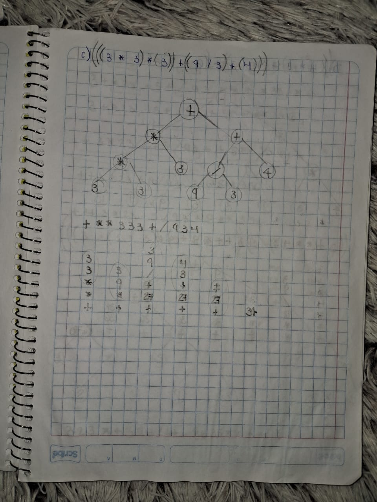
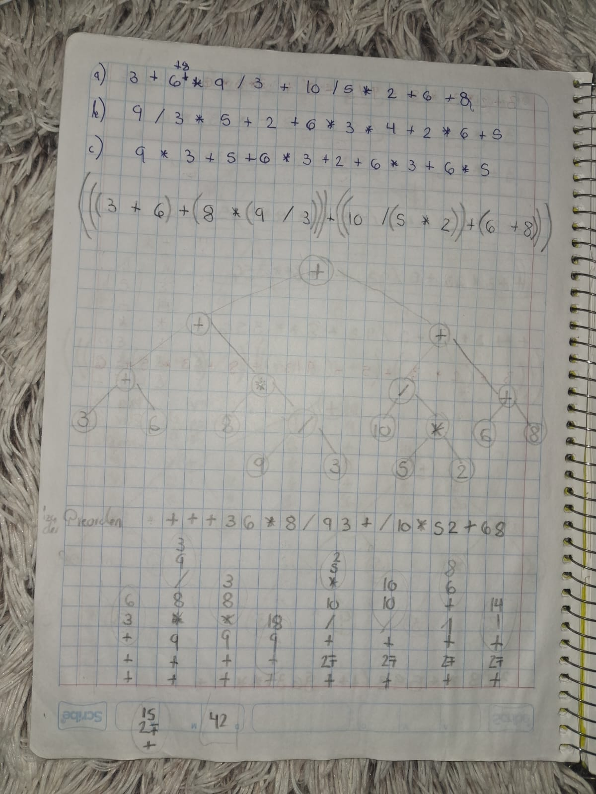

# Tareas - Unidad 1

## Transformar una expresión de Inorden a Preorden
Se resolvieron unos ejercicios para entender como los compiladores evaluan expresiones matemáticas y para familiarizarnos con la forma en que Common Lisp las implementa


## Recorrido de árboles binarios en Preorden
Se implementó otra forma de escribir las expresiones utilizando paréntesis para dividirlas por operación y después construir un árbol de expresión con el resultado final 





## Recorrido de árboles binarios en Preorden y Postorden




## Operaciones de área y volúmen en Common Lisp
```
; Áreas
(defun area-cuadrado(lado)
    (setq resultado (* lado lado))
    (format t "Área del cuadrado: ~A~%" resultado)
    (values)
)

(defun area-trapecio (base-menor base-mayor altura)
    ; (B + b) * h / 2
    ; / (* h (+ B b)) 2
    (setq resultado (/ (* altura (+ base-mayor base-menor)) 2))
    (format t "Área del trapecio: ~A~%" resultado)
    (values)
)

(defun area-rectangulo (altura base)
    (setq resultado (* base altura))
    (format t "Área del rectángulo: ~A~%" resultado)
    (values)
)

(defun area-triangulo (altura base)
    ; b * h / 2
    ; / (* b h) 2
    (setq resultado (/ (* base altura) 2)) 
    (format t "Área del triángulo: ~A~%" resultado)
    (values)
)

(defun area-circulo (radio)
    ; pi * radio^2
    ; * pi (* radio radio)
    (setq resultado (* pi (* radio radio)))
    (format t "Área del círculo: ~A~%" resultado)
    (values)
)

; Volúmenes
(defun volumen-cubo (lado)
    ; l * l * l
    ; * l (* l l)
    (setq resultado (* (* lado lado) lado))
    (format t "Volumen del cubo: ~A~%" resultado)
    (values)
)

(defun volumen-cilindro (radio altura)
    ; pi * r^2 * h
    ; * (* pi (* radio radio)) h
    (setq resultado (* (* pi (* radio radio)) altura))
    (format t "Volumen del cilindro: ~A~%" resultado)
    (values)
)

(defun volumen-esfera (radio)
    ; 4/3 * pi * r^3
    ; * ( * (/ 4 3) pi ) (* (* radio radio) radio)))
    (setq resultado (* (*(/ 4 3) pi) (* (* radio radio) radio)))
    (format t "Volumen de la esfera: ~A~%" resultado)
    (values)
)

(defun volumen-cono (radio altura)
    ; 1/3 * pi * r^2 * h
    ; (*(*(*(/ 1 3) pi) (* r r))h)
    (setq resultado (*(*(*(/ 1 3) pi) (* radio radio))altura))
    (format t "Volumen del cono: ~A~%" resultado)
    (values)
)

(defun volumen-piramide-rectangular (area-base altura)
    ; ab * h / 3
    ; / (* ab h) 3
    (setq resultado (/ (* area-base altura) 3))
    (format t "Volumen de la pirámide rectángular: ~A~%" resultado)
    (values)
)
```

## Funciones Primitivas en CLISP

### 1. Operaciones Matemáticas Básicas
- `+` → Suma
- `-` → Resta
- `*` → Multiplicación
- `/` → División
- `mod` → Módulo
- `1+` → Incrementar en 1
- `1-` → Decrementar en 1

### 2. Operaciones Lógicas
- `and` → Conjunción lógica
- `or` → Disyunción lógica
- `not` → Negación lógica

### 3. Comparaciones
- `=` → Comparación de igualdad numérica
- `/=` → Diferencia
- `<` → Menor que
- `>` → Mayor que
- `<=` → Menor o igual
- `>=` → Mayor o igual

### 4. Manipulación de Listas
- `car` → Devuelve el primer elemento de una lista
- `cdr` → Devuelve la cola de una lista
- `cons` → Construye una nueva lista con un elemento y una lista
- `list` → Crea una lista con los elementos dados
- `append` → Concatena listas
- `length` → Longitud de una lista
- `reverse` → Invierte una lista

### 5. Control de Flujo
- `if` → Estructura condicional
- `cond` → Expresión condicional múltiple
- `case` → Selección basada en valores
- `loop` → Bucle iterativo
- `do` → Bucle generalizado

### 6. Funciones y Evaluación
- `lambda` → Crea una función anónima
- `apply` → Aplica una función a una lista de argumentos
- `funcall` → Llama a una función con argumentos explícitos
- `mapcar` → Aplica una función a cada elemento de una lista

### 7. Entrada y Salida
- `print` → Imprime un valor con salto de línea
- `format` → Imprime texto con formato
- `read` → Lee una expresión desde la entrada

### 8. Tipos y Conversión de Datos
- `type-of` → Devuelve el tipo de un objeto
- `integerp` → ¿Es un entero?
- `floatp` → ¿Es un número de punto flotante?
- `stringp` → ¿Es una cadena?
- `symbolp` → ¿Es un símbolo?


## Calcular el exponente de un número de manera recursiva

```
(defun multiply (x y)
  (if (= y 0)
      0
      (+ x (multiply x (- y 1)))))

(defun power (base exp)
  (if (= exp 0)
      1
      (multiply base (power base (- exp 1)))))
```

## Calcular una división utilizando restas de manera recursiva

```
(defun divide (x y)
  (if (< x y)
      0
      (+ 1 (divide (- x y) y))))

```